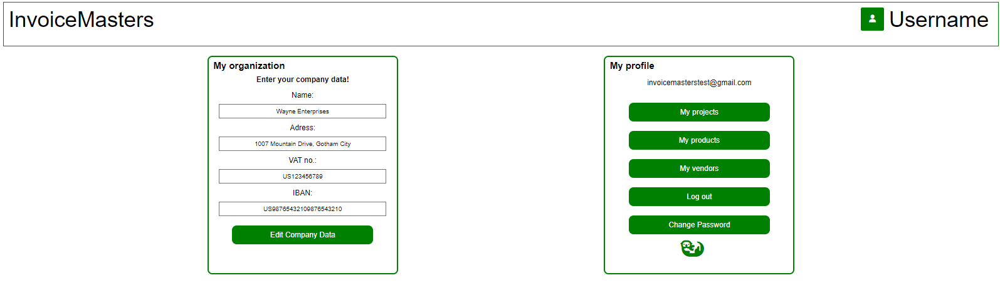

# 🧾 Invoice Masters

This web application is a user-friendly platform designed to streamline the invoicing process for small businesses and freelancers. It provides an intuitive interface for creating customized invoices, managing company, vendor, and product data, and ensures secure access through Firebase authentication. Built with vanilla JavaScript, it leverages Firebase for authentication and storage.

## ✨ Features

- ✨ Create Invoices: Effortlessly generate invoices based on projects using customizable templates.
- 🏢 Manage Data: Efficiently handle company, vendor, and product information within the website.
- 🔒 Secure Authentication: Safeguard your data with Firebase authentication for secure access.
- ⏱️ Save Time: Streamline your invoicing process, increasing efficiency and productivity.

## Document Preview

## Document Builder

## My profile page

## 🛠️ Technologies Used

- 🔥 Firebase: Provides authentication and secure storage for user data.
- 🌐 Vanilla JavaScript: Built entirely with pure JavaScript for frontend functionality.

## 🎈 Usage

1. Open the deployed web app from the github pages [https://xbeatrice.github.io/InvoiceMasters/](https://xbeatrice.github.io/InvoiceMasters/)
2. You can login with these test credentials: invoiceMastersTest@gmail.com and the password test1234, or you create an account (I pinky swear that i don't do anything with the email adress you might use for this)
3. Explore your profile page by adding/editing company information, products, vendors
4. Create a project
5. Create a template (feel free to play with the paragraphs and tables!) 
6. Generate invoices and have fun!

## 🤝 Contributing

Contributions to Neighboards are welcome! If you encounter any bugs, have suggestions, or would like to contribute new features, please open an issue or submit a pull request.

